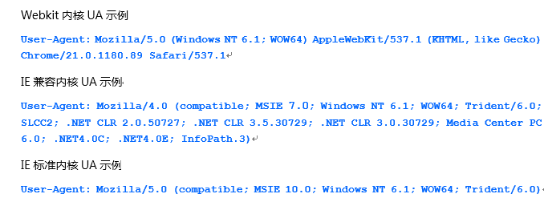

#MarkDown语言：
一种轻量级标记语言，它允许人们“使用易读易写的纯文本格式编写文档，然后转换成有效的XHTML(或者HTML)文档

#标题
使用不同数量的"#"来标识层级，对应于HTML中的h1~h6   

#图片 
一个感叹号，一个方括号里边放图片的替换文字，一个圆括号里面放图片的路径  

#强调："*"可以用"_"替换
*强调*  
**加重强调**  
***特别强调***

#代码：
###用反引号
`var a = 12;` 
###用 >= 4个空格进行缩进的行  
    var b = 15;
    var all = a + b;
    console.log(all);

#换行：
在需要换行的地方输入至少2个空格后再按回车

#引用：
>这里是引用的文字   
>>这是个二级引用的示例

#链接:
[点击进入百度首页](https://www.baidu.com)

#分割线：
输入 >= 3个的 "-" 或 "*" 或 "_"，短横线和星号之间可以输入任意个空格。
***
*  *    *
---
-  --
___
_  _  _

#列表标记：
###方法1：1. + 空格
1. aaa
2. bbb   
###方法2："*/-" + 空格
* aaaaa
- bbbbb

